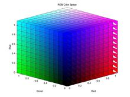

# 计算机输入：数据化的万物

我也明白，看过本系列文章的人都能入门AI是不切实际的，但如果能得到一些人生感悟也是不错的。-----题记


```汉语
一个人跑去中国工程院，托关系后，终于找到了机械科学家。
“我有一个为人类造福的方案”，他说。
“说来听听”，科学家毫无表情应付性地说。
“就是设计一台机器，让鸡蛋进去，鸡排就出来了。避免了环境的破坏与养殖工人的劳累。现在机器的输入输出，商业计划都想好了，就差实现过程了。你们能不能帮助下，获利三七开。”
“。。。。”
```

故事是故事，但却阐述了一个重要的问题。解决方案的三个基本要素：输入，解决过程，输出。别看这么简单，真的不是所有人懂。就像很多人每天都忙碌，却忘记了忙碌的意义。这就是忘了“输出”，仅有“解决过程”。当然这是基本要素，具体问题需要具体修改。针对于算法，有五个基本特征:输入、输出、有穷性、确定性和可行性。我们可以看到，不管怎么变“输入，输出”是个必须谈论的事情。电子计算机的输入输出就是数据，如果想标识世界万物，我们必须用数据的方法解决问题。这就是我们说的“数据化”。

## 1  简单事物数据化

### 1.1 计算机编码

计算机的输入是高电频，低电频信号，转换为数字即为“0-1字符”。一个“0-1字符”是一比特（bit）。我们还可以继续编码，将8个比特编为一组，组成一串二进制数字这就是一字节（Byte）。一个字节可以表示好多含义。如“01000011”这一串“0-1”字符，可以代表十进制的67，当我们用计算机输入67做计算时，计算机就是用“01000011”这一串“0-1”字符存储；如果我们用计算机输入大写英文字母‘C’时，计算机还是用“01000011”这一串“0-1”字符存储。

|八个0-1字符（可直接看成二进制）|十进制|十六进制|ASCII码|
|-|-|-|-|
|0100 0011|67|0x43|C|

~~（中国大陆地区的大学有个奇葩考试，叫计算机二级C语言水平考试。很多人就当考试用学完就忘。）~~是否还记得，在C语言里学过字符可以和数字可以相加减，如‘A’+2 = =‘C’。这就利用了“数字与字符的都是用‘0-1’字符串存储”的本质。

然后呢？我们不要仅仅看到结果，却忽略了方法论。

### 1.2  数据类型

```
题目：请将下面各类数据输入进计算机存储（写清思路即可）
1. 温度数据，例如7摄氏度与8摄氏度等（单位摄氏度）；
2. 街区数据，如香榭丽大街，长安街等；
3. 速度数据，例如1m/s,2m/s（单位m/s）；
```
此时有人会说：“这很简单，用数字+说明文档就可以了。7摄氏度就存储7，8摄氏度就存储8，1m/s就存储1。”
“那么怎么分别哪些是温度，哪些是速度呢？”，质疑者提问。
“分块存储啊，这一块存温度，那一块存速度，不能乱搞吧“
“那街区数据呢?”，质疑者追问。
“这个就有些难了”，他接着回复，“需要和身份证号码一样编号。巴黎香榭丽大街标号0，北京长安街标号1，波士顿自由之路标号2，以此类推。还得有个文档，单独标识下这些数字对应代表什么街道。 ”

这位同学的回答贴近于常见思维。早先计算机工作者的确也是这么做的。但是对于研究算法的我们总觉得哪里不对。。。
1. 两个街区数据不能做运算。街区数据数加减，大小比较等操作的实际意义不明。
2. 两个时间数据加减，具有一定实际的物理意义；但是两时间大小比较却意义不明。
3. 两温度或两速度数据的大小比较操作具有一定实际意义；但这两个数据描述物体状态，加减操作需要额外定义。例如同体积的50摄氏度的水与30摄氏度的水相加，得到的水不是50摄氏度+30摄氏度=80摄氏度。而是要通过比热容重新定义计算方法。

以上基于数字间计算与比较的问题，人们必须定义一个重要的概念：“数字类型”。下面是各种不同数据类型。

| 类型 | 含义                                 |
| ---- | ------------------------------------ |
| 数值 | 具有实际测量意义，可以计算           |
| 类别 | 数值不能计算，没有数值意义，仅定性   |
| 时间 | 年月日：时分秒，特别常用这里单列     |
| 空间 | 地理位置信息，可以计算但不能简单计算 |

仔细观察，上面这些类型好像与SQL关系型数据库的通用格式很像。的确，数据库软件的存在的最初目的就是对事物进行数据化存储。围绕商用数据库开发的各式计算机系统，前所未有地提高了各大公司，机构，科研院前所的办事效率。带来现金流量，持续支持计算机发展半个多世纪。在大数据数据时代，数据存储的本质已经大变样：我们期望将大文件数据（如图片，音频，视频等大文件数据）全都录入计算机。每个文件过大过复杂，已经不能用几个简单的数字字符组合编码了。因此我们必须设计新的数据化方式。值得欣喜的是，国际上已经定义了很多种方式，将这些较复杂的文件进行数据化。

## 2. 复杂事物数据化
### 2.1 图片编码

目前的图片大都是采用了RGB颜色标准（红色、绿色、蓝色用英文表示就是R(red)、G(green)、B(blue)）由红、绿、蓝三种色光按照不同的比例混合而成的。一组红、绿、蓝可以组成一个最小的显示单位，我们叫它**像素**。将若干像素排列成M行N列的方阵，就形成了一幅图片。我们将M乘以N，称为图片的分辨率。

这里好像有哪些不对劲：

1. 因为图片是矩阵，离散像素矩阵不能精确表示曲线；
2. 图片的清晰度取决于分辨率与像素大小：分辨率越大，像素越小，曲线表现得越好，画面越清晰；
3. 图片利用了人眼对整体像素矩阵的视觉误差。理论上我们（不用相机）合理填色M乘以N的格子阵列，也可以形成一张M乘N的图片。(早期icon图标就是这么填出来的)
    

这的确是个大问题。因此，有人提出来矢量图的概念，并相对应地称RGB像素点阵图为位图（或栅格图）。矢量图是根据几何特性绘制，可以是一个点或一条线。因为实景图片内容繁杂，存在多到几乎数不清的几何特征，所以我们用相机拍摄的照片还不存在矢量存储格式。因为矢量的特点，放大后图像不会失真，所以该格式适用于图形设计、文字设计和一些标志设计、版式设计等。
```
小故事：字体
在计算机文字排版中，汉字的本质就是矢量图。因为文字排版要求无论文字放大多少倍，文字的清晰度都不变。如果使用位图，则会出现存储数据过大以及文字放大模糊的情况。目前的矢量图基本都是用软件做出来的。
字体不是某某计算机大神敲击几行代码就出现的，而是由各个字体设计师绘制或构建而成。由于汉字数量庞大，字体设计师的工作非常枯燥辛苦。
在国内，版权意识不强，更没有为字体付费的习惯，加上某知名字体厂商养肥了再“律师函警告”的行为，直接导致国内字体发展畸形。
```

### 2.2 视频编码

视频是利用人眼视觉暂留的原理，通过播放一系列的图片，使人眼产生运动的感觉。电影放映的标准是每秒放映24帧，即每秒24张图片。一般游戏最少要30帧，而如果是fps或dota类游戏，至少需要60帧以上。两者帧数差异之所以这么大，是因为单纯的电影不需要观众进行实时互动参与，人们对镜头有基本的反应（如果镜头太混乱是导演的问题），而游戏不一样，不知道哪一秒突然从草丛中冲出个喊“德玛西亚”的，一秒钟的控制就已经决定了游戏的胜负了。所以说，推动显卡发展的的不是高频而是大型实时游戏。

当然，单纯传输视频画面，视频量非常大，对现有的网络和存储来说是不可接受的。为了能够使视频便于传输和存储，人们决定压缩编码。这里的压缩不是将帧数减少，而是将信息在发送端压缩，在接收端恢复出来。因为人们发现相近视频帧中有大量重复的信息。顺着这个思路就有了H.264视频压缩标准。

在H.264压缩标准中I帧、P帧、B帧用于表示传输的视频画面。

1. I帧又称帧内编码帧，是一种自带全部信息的独立帧，无需参考其他图像便可独立进行解码，说白了就是一张静态画面。视频序列中的第一个帧始终都是I帧，因为它是关键帧。

2. P帧又称帧间预测编码帧，需要参考前面的I帧才能进行编码。表示的是当前帧画面与前一帧（前一帧可能是I帧也可能是P帧）的差别。解码时需要用之前缓存的画面叠加上本帧定义的差别，生成最终画面。与I帧相比，P帧通常占用更少的数据位，但缺点是对错误非常敏感。

3. B帧又称双向预测编码帧，也就是B帧记录的是本帧与前后帧的差别。也就是说要解码B帧，不仅要取得之前的缓存画面，还要解码之后的画面，通过前后画面的与本帧数据的叠加取得最终的画面。B帧压缩率高，但是对解码性能要求较高。

此时此刻，我么好像提到了什么不得了的概念。嗯，**解码器**。

我们是在网页看视频，还是在本地看电影。我们都记得视频播放器中有一个“视频解码器加速”选项。

