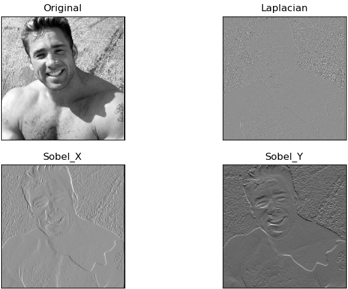
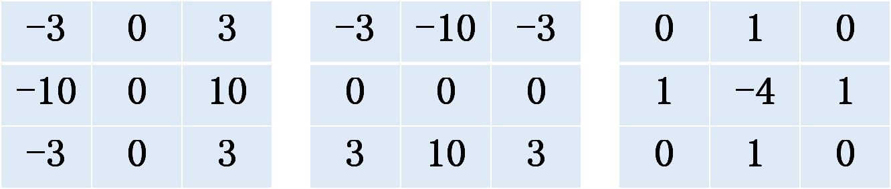

# 4 数据特征提取

我们的目标是“**让计算机具有学习能力，计算机能够自己适应事先不可知事物的新输入**”。前人通过模拟人类的思考方式，想到了一种方法：可以将“不可知事物的输入”改换成“不可知事物数字特征的输入”，化不可运算数据为可运算数据。

## 1 特征与嵌入思想

### 2.1 特征选择提取--主要思想：数据降维

特征工程指的是把原始数据转变为模型的训练数据的过程，它的目的就是为了获取更好的训练数据特征。什么叫更好的特征？这个很有说法。在特征工程发展初期，特征选择与提取阶段往往依靠经验丰富的专家。这也衍生出一种程序系统叫“专家系统”。特征选择是从特征中选出一个子集，而特征提取是从原始数据中构造出新的特征。特征提取体现了典型的“数据降维”思想，但是绝不是唯一具有“数据降维”思想的机器学习过程。

#### 2.1.1 传统机器学习特征选取
特征选取与降维是强关联。特征提取分为两种：线性特征提取，非线性特征提取。线性特征提取有PCA-主成分分析，LDA-线性判别分析，等等。非线性特征提取更多：如各种聚类，分类方法。
1. 主成分分析
主成分分析的原理是将一个高维向量，通过一个特殊的特征向量矩阵，投影到一个低维的向量空间中，并且仅仅损失了一些次要信息。也就是说，通过低维特征可以基本重构出所对应的原始高维向量。这个算法在现代推荐系统中也十分常见。SVD算法就是一种主成分分析方法。
2. LDA-线性判别分析
LDA是一种监督学习的降维技术，也就是说它的数据集的每个样本是有类别输出的。这点和PCA不同。PCA是不考虑样本类别输出的无监督降维技术。LDA是通过将数据在低纬度上进行投影，投影后希望每一种类别数据的投影点尽可能的接近，而不同类别的数据的类别中心之间的距离尽可能的大。
3. 聚类
将物理或抽象对象的集合分成由类似的对象组成的多个类的过程被称为聚类。由聚类所生成的簇是一组数据对象的集合，这些对象与同一个簇中的对象彼此相似，与其他簇中的对象相异。每一簇就是一类特征。 对于聚类在实际的应用中亦是非常广泛的，如：市场细分、社交圈分、集群计算、天体数据分析。更多内容可以点击看这里：https://blog.csdn.net/dajiabudongdao/article/details/52053222
#### 2.1.2 基于梯度的图片的特征选取
传统图片认为识别物体最关键的因素是梯度（这就衍生出SIFT/HOG这两种算法），梯度意味着边缘，这是最本质的部分，而计算梯度，自然就用到灰度图像了，可以把灰度理解为图像的强度。而且颜色，易受光照影响，难以提供关键信息，故将图像进行灰度化，同时也可以加快特征提取的速度。这也是一种降维，将彩色图片变成线条图片。如下图：

为了得到这样的图片，我们可以使用梯度算子模板对图片进行卷积操作。梯度算子模板有Sobel 算子，Scharr 算子和Laplacian 算子等

1. Sobel 算子和 Scharr 算子
Sobel 算子是高斯平滑与微分操作的结合体，所以它的抗噪声能力很好，可以设定求导的方向（xorder 或 yorder），还可以设定使用的卷积核的大小（ksize），如果 ksize=-1，会使用 3x3 的 Scharr 滤波器，它的的效果要比 3x3 的 Sobel 滤波器好（而且速度相同，所以在使用 3x3 滤波器时应该尽量使用 Scharr 滤波器）。
2. Laplacian 算子
拉普拉斯算子可以使用二阶导数的形式定义，可假设其离散实现类似于二阶 Sobel 导数，事实上， OpenCV 在计算拉普拉斯算子时直接调用 Sobel 算子。

上方依次为3x3的 Scharr 滤波器卷积核x方向，y方向，拉普拉斯算子时直接调用 Sobel 算子卷积核。我们常用的特征提取方法还HOG，SIFT两种
3. HOG（histogram of oriented gradients）
HOG通过统计计算图像局部区域的梯度方向直方图来构成特征。梯度的方向是标量场增长最快的方向，梯度的大小是这个最大的变化率。对图像来说，图像的梯度即像素值变化最快的方向，并且图像的边缘与梯度保持垂直。图像局部区域的特征能够被梯度或边缘的方向密度分布很好的描述。
4. SIFT（scale invariant feature transform）
SIFT 特征通常与使用SIFT检测器得到的感兴趣点一起使用。这些感兴趣点与一个特定的方向和尺度（scale）相关联。通常是在对一个图像中的方形区域通过相应的方向和尺度变换后，再计算该区域的SIFT特征。SIFT算法的实质是在不同的尺度空间上查找关键点(特征点)，并计算出关键点的方向。SIFT所查找到的关键点是一些十分突出，不会因光照，仿射变换和噪音等因素而变化的点，如角点、边缘点、暗区的亮点及亮区的暗点等。

#### 2.1.3 卷积神经网络进行图片特征选取

从上一节可以看出，我们需要精心设计模板参数，才能达到我们的需求。有没有可能让机器自己学习模板参数？深度学习CNN就是这个思想。